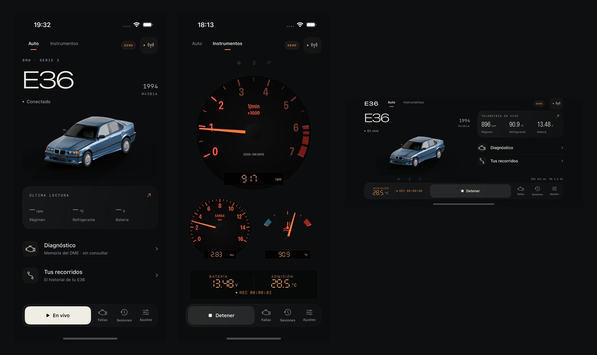
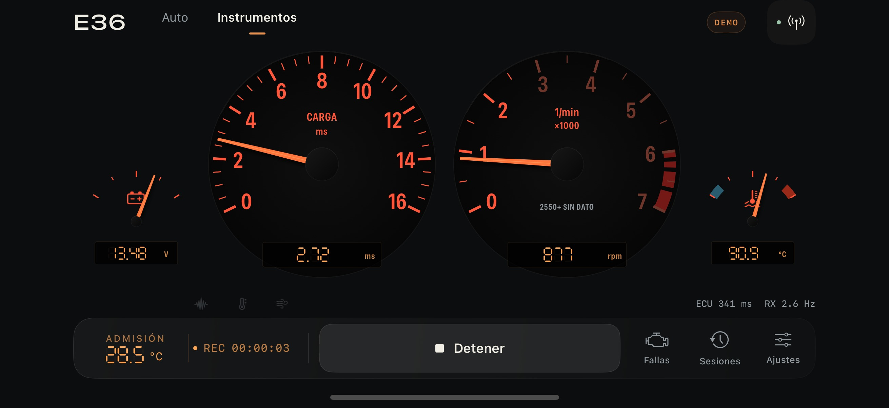
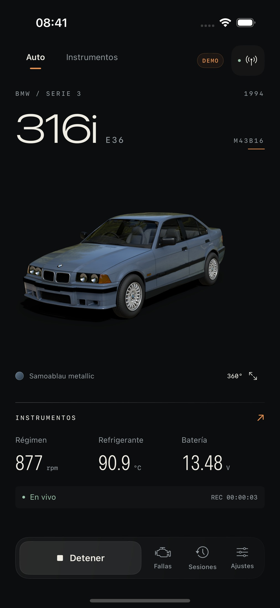
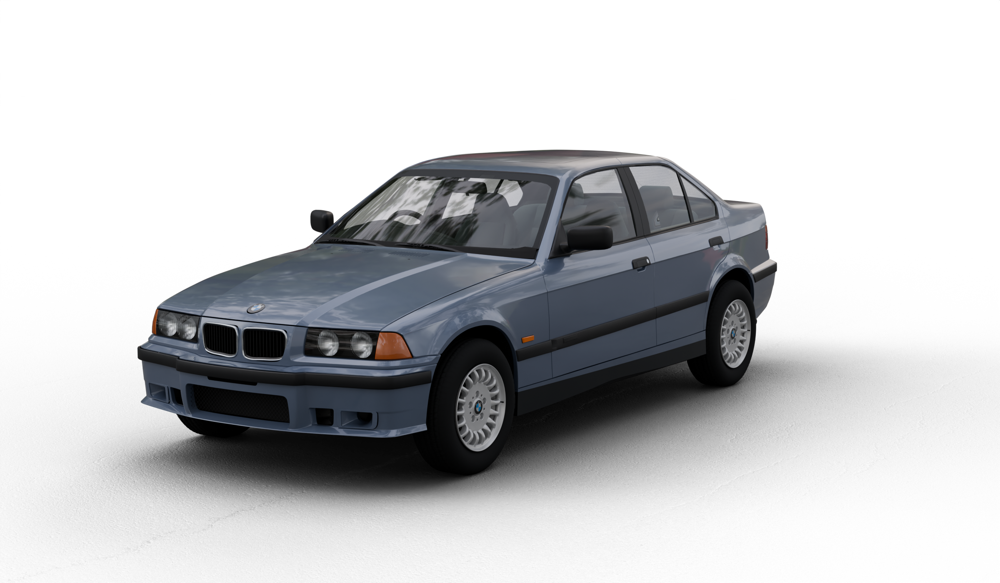
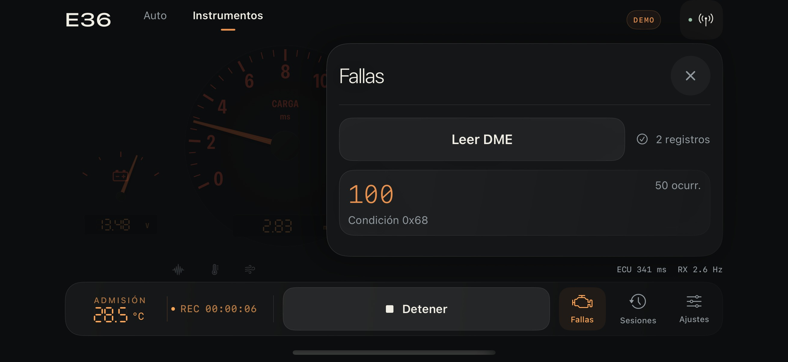
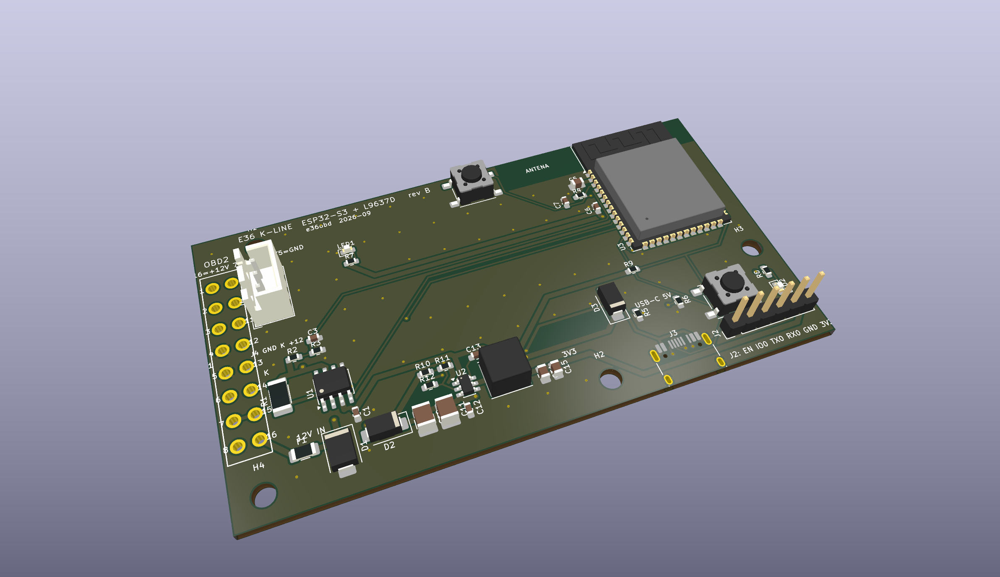
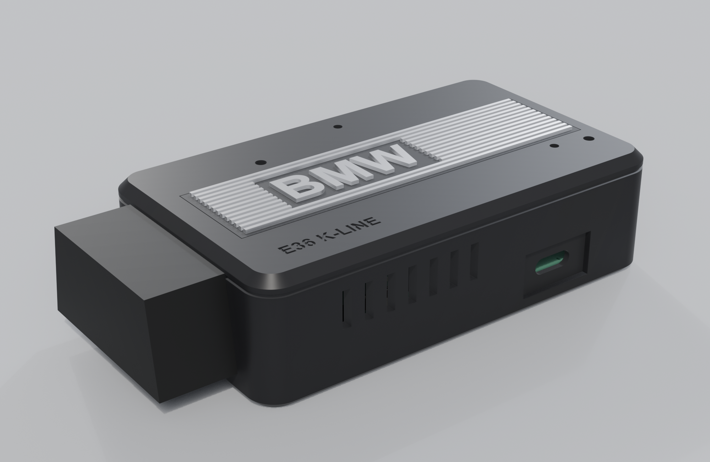
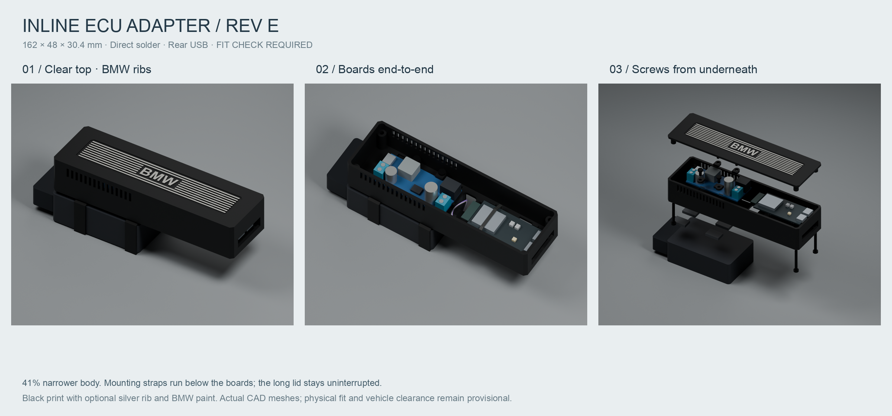

<div align="center">

# E36 OBD

**Read a pre-OBD2 BMW's brain — from a Mac, an iPhone, an Apple Watch, or a board you build yourself.**

A 1994 BMW E36 316i (M43B16, Bosch Motronic 1.7.2) predates OBD2. It speaks **KWP71** over a single-wire **K‑line**, woken with a 5‑baud slow init. A generic OBD2 scan tool can't talk to it at all — not "fewer PIDs", it will *never* establish a session. The usual answer is a Windows laptop running INPA. This isn't that: it's a Mac client, a native iOS/watchOS app, ESP32 firmware, and two open hardware builds — all offline, no Windows, no VM, no third‑party dependencies.




</div>

---

## Four ways to read the car

| | Component | What it is | Where |
|---|---|---|---|
| 🖥️ | **macOS client + web panel** | ~600 lines of Python (stdlib + `pyserial`) driving an FTDI K‑line cable through Apple's built‑in `AppleUSBFTDI` — the 5‑baud wakeup is bit‑banged with the UART's BREAK control. CLI **and** a local web dashboard. | [`e36obd/`](e36obd/) · [client reference](#-macos-client--web-dashboard) |
| 📱 | **iOS + Apple Watch app** | Native SwiftUI BLE dashboard: authentic E36 instruments, a real‑time 3D car, DME fault reading, session recording to SQLite, CSV export, widgets, CarPlay and Live Activities. No servers, no internet. | [`ios/`](ios/) · [details](#-ios--apple-watch-app) |
| 🔌 | **ESP32‑S3 firmware** | MicroPython K‑line ⇄ BLE bridge (Nordic UART) that the app talks to. Plus an Arduino reference sketch and a WiFi/PWA fallback. | [`firmware/`](firmware/) · [details](#-firmware-esp32-s3) |
| 🧩 | **Onboard board (rev B)** | A custom single PCB — ESP32‑S3 + L9637D + AP63203 buck + an OBD2 plug — that plugs straight into the car, in a printed case with a machined‑look **=BMW=** badge. | [`hardware/onboard/`](hardware/onboard/) · [details](#-hardware) |
| 🛠️ | **ELM backpack (rev E)** | A printed enclosure that turns a gutted ELM327 + an ESP32 DevKit into an inline reader — the salvage build the custom board replaces. | [`hardware/elm-backpack/`](hardware/elm-backpack/) · [details](#-hardware) |

---

## Why it's hard (and what was learned on the car)

K‑line‑only BMWs (E36, E38, E39, early E46) expect the diagnostic K‑line on **OBD2 pin 7**, wake on a **5‑baud** address, and run **KWP71**: framed blocks `[length][seq][title][payload…][0x03]` where *every byte but the last* is acknowledged by its bitwise inversion, in both directions. There is no error recovery — one bad byte ends the session.

This was **verified end‑to‑end on a 1994 E36 M43B16 automatic** (2026‑08‑09). The findings that cost the most to discover:

- **The L‑line jumper is mandatory.** A stock K+DCAN cable drives only OBD2 pin 7, but the 1.7‑era DME wants the 5‑baud wakeup on the **L‑line** (OBD2 pin 15). The fix is a solder bridge between **pins 7 and 15** — the instant it was in, address `0x10` answered `55 00 81`. (Watch pin 16: it's +12 V.)
- **Address is `0x10`** (BMW Motronic DME), not `0x12` (that's DS2, a different protocol).
- **Live values only populate with the engine running** — key‑on/engine‑off reads all zeros and looks exactly like a dead link.
- **Sampling is round‑trip bound** at ~1 Hz over 9600 baud, so a log's silence is not proof a sub‑second glitch didn't happen.
- **Reads degrade with the engine running** — ignition noise corrupts the byte handshake, so the live path collapses the core sensors into one contiguous 11‑byte read and rebuilds the session when it breaks.

> 📎 Full pre‑flight electrical checklist, the discovery method for un‑mapping sensors, and protocol notes are in [the client reference below](#-macos-client--web-dashboard) and [`docs/PROTOCOL_NOTES.md`](docs/PROTOCOL_NOTES.md).

---

## 📱 iOS + Apple Watch app

[`ios/E36OBD.xcodeproj`](ios/) — a native SwiftUI dashboard that reads the car over **BLE**, with no server and no internet. iOS 18+, watchOS 11+, **zero third‑party dependencies** (SQLite is the system `libsqlite3`; everything else is Apple's own frameworks).

<table>
<tr>
<td width="60%"></td>
<td width="40%"></td>
</tr>
<tr>
<td align="center"><em>Instruments — the E36 cluster, rebuilt</em></td>
<td align="center"><em>Auto — vehicle, reader state, latest readings</em></td>
</tr>
</table>

**What it does**

- **Instruments** — the classic 90s BMW cluster in portrait and landscape: load (ms) and tach dials with the red zone, battery/coolant gauges, amber 7‑segment readouts, fan‑out auxiliaries. Needles ease to each reading without interpolating stored samples. Saturated 2550 rpm and empty‑RAM reads are called out as **DME sin datos** rather than shown as real values.
- **Auto** — a real‑time **3D render of the owner's 316i in Samoablau**, drawn on‑device with RealityKit + Metal (drag to orbit, pinch to zoom, two‑finger drag for height). Paint, glass and reflections are computed on the phone.
- **Faults** — reads the DME fault memory; pauses and resumes the same recording session around the read.
- **Sessions** — every capture recorded to local SQLite (WAL, file‑protected), browsable with a shared cursor across all five channels and **CSV export** of sensors + events. Gaps are never bridged.
- **Alerts** — configurable thresholds (low load, coolant, intake) with hysteresis, sound and haptics; every episode is logged even when sound is rate‑limited.
- **Widgets · CarPlay · Watch · Live Activities** — an *Instrumento E36* widget for the Home Screen, StandBy and CarPlay; a watchOS companion with five full‑screen gauges and complications; and a Live Activity on the Lock Screen and Dynamic Island. The ESP32 keeps a single BLE link to the phone; everything else is fed from it.

<table>
<tr>
<td></td>
<td></td>
</tr>
</table>

**Architecture.** The tested, platform‑independent core is a local Swift package, [`ios/Core`](ios/Core) (`E36Core`), so the hard parts run without a simulator:

| Module | Responsibility |
|---|---|
| `AcquisitionMachine` | pure state machine for BLE capture (sync → idle → live, faults, DME recovery) |
| `WireProtocol` | frames raw bytes into lines before UTF‑8; parses telemetry vs text |
| `SessionStore` | an `actor` owning the sole SQLite connection; records off the UI/BLE threads; CSV export |
| `AlertEngine` | threshold rules with hysteresis |
| `Models` · `GraphSeries` · `WidgetSnapshot` · `CompanionSnapshot` | sensor model, downsampling that keeps extrema/events, and the bounded snapshots shared to widgets and the watch |

```sh
open ios/E36OBD.xcodeproj          # E36OBD Demo runs on the simulator (scenario picker, no BLE radio)
swift test --package-path ios/Core # 19 core tests, no simulator needed
```

The Xcode project is generated, not hand‑edited — `python3 ios/tools/generate_project.py` regenerates it with the stdlib alone. Deeper docs: **[`ios/DESIGN.md`](ios/DESIGN.md)** (instrument design), **[`ios/VALIDATION.md`](ios/VALIDATION.md)** (QA log), **[`ios/WIDGETS.md`](ios/WIDGETS.md)**, **[`ios/WATCH_AND_LIVE_ACTIVITIES.md`](ios/WATCH_AND_LIVE_ACTIVITIES.md)**, and the 3D pipeline in **[`ios/Design/Vehicle/`](ios/Design/Vehicle/)**.

---

## 🔌 Firmware (ESP32‑S3)

The board runs **MicroPython** (`ESP32_GENERIC_S3‑SPIRAM_OCT`, v1.29.0). On boot, [`firmware/mp/main.py`](firmware/mp/main.py) does `import ble; ble.arrancar()`, starting the BLE loop on its own thread so attaching the REPL doesn't kill it.

| Module | Role |
|---|---|
| [`firmware/mp/kline.py`](firmware/mp/kline.py) | KWP71 transport: 5‑baud slow init, block send/recv with inverted acks, RAM reads, sensor + fault decode. Drives the **ST L9637D** on `TX=GPIO17`, `RX=GPIO18`. DME at **9600 baud** (`0x10`); the automatic gearbox EGS at **4800 baud** (`0x6C`). |
| [`firmware/mp/ble.py`](firmware/mp/ble.py) | The BLE "panel": Nordic UART service, command loop, live streaming, fault reads, session lifecycle and desktop‑grade recovery. |
| [`firmware/mp/web.py`](firmware/mp/web.py) | Optional WiFi SoftAP dashboard (`E36-OBD` / `192.168.4.1`), not started at boot. |
| [`firmware/kline_e36/kline_e36.ino`](firmware/kline_e36/) | An Arduino/C++ reference port of the same protocol — a bring‑up sketch that inits and reads faults once over USB serial. |

**BLE contract** — advertises the **name only** (`E36-OBD`); the app verifies Nordic UART after connecting.

```text
service 6E400001-B5A3-F393-E0A9-E50E24DCCA9E   RX 6E400002-… (write)   TX 6E400003-… (notify)
commands (1 ASCII char): v = live · f = faults · s = stop · ? = help
live line:  D <rpm> <load_ms> <coolant_C> <battery_V> <query_ms> [intake_C]
            D 930 0.70 63.1 13.48 341 23.7
```

Output is CRLF, chunked ≤20 bytes with 12 ms between notifications; intake temp is appended last so older clients stay compatible. **Update firmware over USB** with [`ios/tools/update_ble.py`](ios/tools/update_ble.py) (via `mpremote`) — it backs up every target file, verifies it's really the E36 reader, writes, reads back, and rolls back on any mismatch. It never reflashes MicroPython or touches `main.py`.

Host‑run tests in [`firmware/tests/`](firmware/tests/) exercise the real modules against a scripted fake UART / mocked radio — including a byte‑for‑byte match against the desktop client:

```sh
python3 -B -m unittest discover -s firmware/tests -v
```

---

## 🧩 Hardware

Two open builds, both parametric — a Python source file generates the board or the case, verified by script before export.

### Onboard board — rev B (`hardware/onboard/`)

One 90 × 50 mm two‑layer PCB for JLCPCB SMD assembly: **ESP32‑S3‑WROOM‑1 + L9637D + AP63203 buck + a PCB‑mount OBD2 plug**. 3.3 V straight from the car's 12 V, a hardware low‑battery cutoff (buck EN divider: on at 12.5 V, off at 11.5 V), and it plugs directly into the E36's 20‑pin round connector via a pigtail. `gen_board.py` is the source of truth — placement, nets, zones and the custom OBD2 footprint; `export.py` runs DRC and emits gerbers/BOM/CPL. **DRC: 0 errors.**

<table>
<tr>
<td></td>
<td></td>
</tr>
<tr>
<td align="center"><em>The board — ESP32‑S3 + L9637D + buck + OBD2</em></td>
<td align="center"><em>The case — =BMW= badge, light‑guide LED, USB‑C</em></td>
</tr>
</table>

`case.py` generates a three‑piece printed enclosure (96.8 × 56 × 27 mm) with a separate **silver =BMW= badge** that seats flush in the lid — the M50 valve‑cover look: black field, silver ribs and letters. See [`hardware/onboard/README.md`](hardware/onboard/README.md) for the full BOM, the schematic, the pinout and the pre‑fab checklist. ([schematic](hardware/onboard/fab/schematic.png))

### ELM backpack — rev E (`hardware/elm-backpack/`)

The predecessor build: a 162 × 48 × 30.4 mm printed inline enclosure that houses a gutted ELM327 + a buck + an ESP32‑S3 DevKit end‑to‑end, with the same ribbed BMW lid. Fully parametric (`model.py` on build123d), with an offline interactive [CAD viewer](hardware/elm-backpack/viewer.html) and print‑ready 3MF/STL.



Details, the parts list and print settings: [`hardware/elm-backpack/README.md`](hardware/elm-backpack/README.md).

---

## 🖥️ macOS client & web dashboard

Pure Python — stdlib plus `pyserial`. It drives an FTDI **FT232R "INPA compatible K+DCAN"** cable through the OS's own `AppleUSBFTDI` (no vendor kext), bit‑banging the 5‑baud init with the UART's BREAK control. From the repo root:

```bash
python3 -m venv .venv && ./.venv/bin/pip install pyserial   # first time
./.venv/bin/python -m e36obd doctor                         # desk test, no car
```

**Command line** — run in order; each only makes sense once the previous worked:

| Command | What it does |
|---|---|
| `doctor` | Lists serial ports, flags the FTDI one, toggles BREAK, listens 2 s. Silence with no car is fine. |
| `scan` | Tries candidate addresses (`0x10` first) and reports which return a `0x55` sync + keywords. |
| `id` | Prints the ECU identification strings — the real proof of a working link. |
| `codes` | Reads stored fault codes (raw hex; a *speculative* 5‑byte grouping is not a verified decode). |
| `log` | Live values to CSV — `--adc`, `--ram ADDR:LEN`, `--param`, `--interval`, `--duration`, `--out`. |
| `raw` | Sends an arbitrary block title with optional payload — for hunting non‑standard commands. |
| `clear` | Erases fault memory (prompts). **Destroys evidence — read and save codes first.** |

Global flags go **before** the subcommand: `--port`, `--baud` (9600), `--address` (`0x10`), `--loopback auto|on|off`, `-v`. Example: `./.venv/bin/python -m e36obd --address 0x10 -v id`.

**Web dashboard** — `dash` serves a local panel (stdlib + `pyserial`, no framework/CDN, works offline). One thread owns the serial port and drains an action queue between samples, so recording, re‑reading faults, dumping RAM and probing the gearbox coexist with live polling without fighting over the line.

```bash
./.venv/bin/python -m e36obd dash            # http://127.0.0.1:8036
./.venv/bin/python -m e36obd dash --lan      # reachable from the phone, token-guarded
./.venv/bin/python -m e36obd dash --demo     # synthetic data, no car
```

Four hash‑addressable tabs — **Tablero** (analog instruments + 4‑min trend), **Diagnóstico** (decoded faults, DS2 gearbox probe, before/after snapshots), **Capturas** (recorded sessions with a shared cursor and two‑session overlay), **Scanner** (RAM explorer with cumulative change detection). Write and actuator blocks (`0x02` WriteRAM, `0x1A` WriteEEPROM, `0x04` ActivateActuator) are blocked **in the server**, verified against a simulated ECU. There's also a Web Bluetooth **PWA** in [`docs/ble/`](docs/ble/).

<details>
<summary><strong>Pre‑flight electrical checklist</strong> — read this before the cable ever touches the car</summary>

Almost every "it doesn't work" report is one of these three, and all three fail *silently* — the port opens, the command runs, and nothing answers.

1. **OBD2 pins 7–8 must be bridged.** K‑line‑only BMWs expect the K‑line on pin 7; many cables/adapters present it on pin 8. Set the cable's K‑line switch, or solder 7↔8 on its PCB. Verify with a multimeter in continuity: probe pin 7 and pin 8 on the cable's own 16‑pin connector — it should beep.
2. **The 20‑pin adapter must be fully pinned.** The cable is bus‑powered from OBD2 pin 16 (+12 V from the car). Cheap adapters wired K‑line‑and‑ground only leave the FTDI chip unpowered. Confirm it passes at minimum K‑line, +12 V and ground.
3. **Multimeter checks — verify, don't trust.** Confirm the 20‑pin round pinout against a BMW source (TIS / service manual) before probing; several conflicting diagrams circulate. Do continuity with the harness **disconnected from the car**; do voltage at the car's connector with nothing else plugged in.

| Check | Meter mode | Expected |
|---|---|---|
| Battery at the round connector's +12 V pin | DC volts, black on chassis ground | ~12.4 V off, ~13.8–14.4 V running |
| Round K‑line pin → OBD2 pin 7 | Continuity, unplugged from car | Beeps / ~0 Ω |
| Round +12 V pin → OBD2 pin 16 | Continuity, unplugged | Beeps / ~0 Ω |
| Round ground pin → OBD2 pins 4 and 5 | Continuity, unplugged | Beeps on both |
| OBD2 pin 7 → pin 8 on the cable itself | Continuity | Beeps (see §1) |

4. **Ignition position 2.** The DME is only awake with the ignition in position 2 (dash lights on, engine not running). Position 1 is not enough; nothing answers with the key out.

</details>

<details>
<summary><strong>Discovering what the values mean</strong> — ADC channels and the RAM map are un‑mapped</summary>

`log` is a **discovery tool**, not a dashboard: there's no table saying which channel is coolant or where the TPS lives, and raw ADC bytes are not degrees. The method is empirical — change **one** thing with a known physical effect, then find the column that moved the same way.

- **Coolant temp** — log a full sweep through a cold‑start warm‑up; it's the channel that moves *monotonically* over ~10 min then flattens (NTC sensors often fall as temp rises).
- **Throttle** — engine off, ignition on; sweep the pedal. TPS tracks the pedal, returns to rest, and hits a ceiling at wide‑open.
- **Battery** — calibrate absolutely against the multimeter; two points give a linear scale and often hint at the shared ADC reference.
- **Intake air** — responds within seconds to a heat gun, unlike coolant's minutes of lag.

Prefer monotonic or repeatable‑cycle stimuli, load the CSV into anything that plots, then re‑log the interesting channels at a shorter interval. **Nothing here persists a mapping for you — write down what you confirm.**

</details>

<details>
<summary><strong>Troubleshooting</strong></summary>

| Symptom | Likely cause | What to do |
|---|---|---|
| `No serial port found` | Cable not enumerated, or macOS hasn't claimed it | `ls /dev/cu.*`; try another USB port/cable; `system_profiler SPUSBDataType`; pass `--port`. |
| `doctor` opens the port but BREAK fails | `/dev/tty.*` selected instead of `/dev/cu.*`, or a vendor FTDI kext interfering | Always use `/dev/cu.*`; uninstall any vendor FTDI driver and reboot. |
| `scan` finds no responding address | Almost always electrical | Work the pre‑flight list in order before widening the address set. |
| Init OK but blocks fail their ack — `bad ack for byte N` | Timing / line quality, or non‑standard framing | Re‑run with `-v`; try a shorter adapter; if always byte 0, force `--loopback on|off`. |
| Session establishes then dies mid‑`log` | KWP71 drops the link if blocks stop; also a loose‑connection signature | Lower `--interval`, fewer channels; then check the physical connection. |
| Disconnects worse with the engine running | Ignition noise on a single‑wire bus, or a sagging supply | Route away from plug leads/coil; verify pin‑16 voltage running; clean ground. |
| `NOT_SUPPORTED` | BMW used a different block title | Probe with `raw --title 0xNN`. |

</details>

<details>
<summary><strong>Known vs unknown</strong> — how much to trust the output</summary>

**Solid:** KWP71 framing and acks (from [colinbourassa/libiceblock](https://github.com/colinbourassa/libiceblock)); the macOS BREAK‑banged 5‑baud init (absolute bit deadlines, the port never leaves 9600); loopback auto‑detection.

**Not confirmed:** exact block titles may be non‑standard per manufacturer; the fault‑code record layout and code→description mapping are **not** decoded (a code number without a table tells you a fault exists, not what it is); ADC channel meanings, the RAM map and scaling are unknown and must be derived. `raw` and `log` exist precisely to explore this.

</details>

---

## Repository layout

```
e36obd/         macOS client + web dashboard (Python: stdlib + pyserial)
firmware/       ESP32-S3 firmware — mp/ (MicroPython, shipping) + kline_e36/ (Arduino ref) + tests/
ios/            SwiftUI iOS + watchOS app — E36OBD.xcodeproj, Core/ (E36Core package), Design/Vehicle/ (3D)
hardware/       onboard/ (rev B custom PCB + case) · elm-backpack/ (rev E enclosure) · wiring diagrams
docs/           PROTOCOL_NOTES.md, EGS_NOTES.md, GAUGE_DESIGN.md, cableado.html, ble/ (Web Bluetooth PWA)
sessions/       archived AI-assisted development transcripts (Git LFS)
```

Large binary assets (`.usdz`, `.blend`, `.glb`, `.exr`, `.step/.stl/.3mf`, `.pdf`, session logs) are tracked with **Git LFS** — install [git‑lfs](https://git-lfs.com) and `git lfs pull` to fetch them.

## Safety

- **Do not probe pins at random with the ignition on.** Shorting a DME input to +12 V or ground can destroy it, and not every line is fuse‑protected. An M1.7.2 is expensive and increasingly rare.
- Do continuity testing with the harness **disconnected from the car**; do voltage testing one pin at a time against a known‑good ground.
- **Verify the round‑connector pinout against a BMW source before touching a probe to it.** Assume any diagram — including in this repo — is wrong until you've checked it. Beware pin 16 (+12 V) next to the K‑line.
- **`clear` and fault‑memory erase destroy evidence.** Read and save codes first; the web panel always snapshots before erasing.
- `raw` sends arbitrary block titles to a live engine controller. `WRITE_RAM`, `WRITE_EEPROM` and `ACTIVATE_ACTUATOR` are not read‑only. Know what a title does before sending it.
- Do first‑contact work engine‑off. Once logging with the engine running, keep the cable clear of the belts, fan and exhaust manifold.

---

<div align="center">
<sub>Personal project for a specific 1994 E36 316i (M43B16). No affiliation with BMW; "BMW" marks belong to their owner and the badge/branding here are for a personal build. No formal license — ask before reuse.</sub>
</div>
