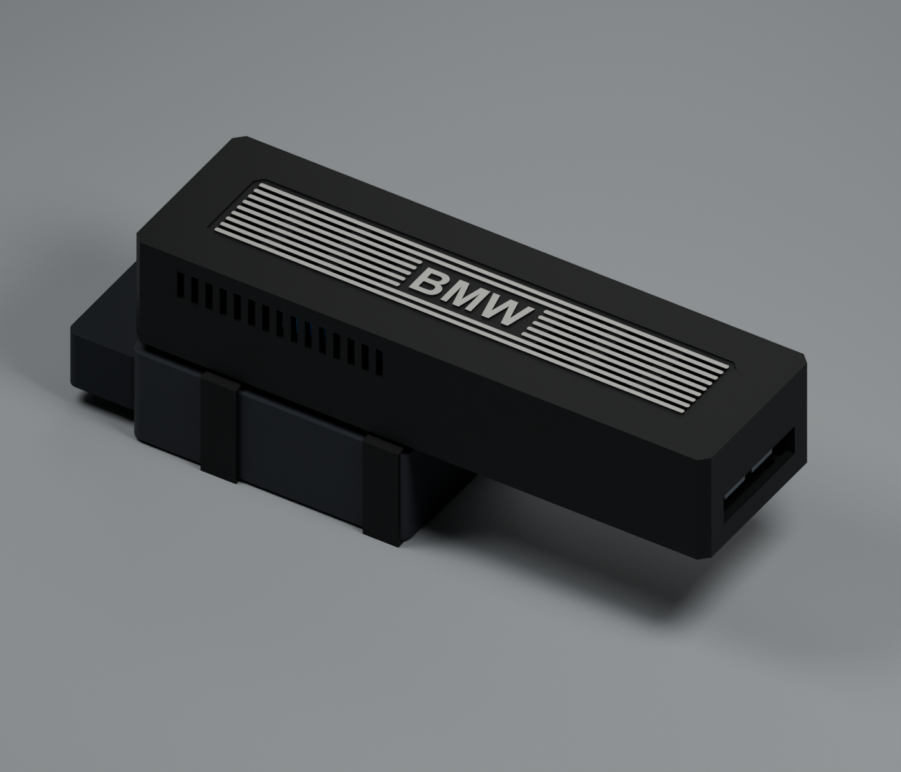
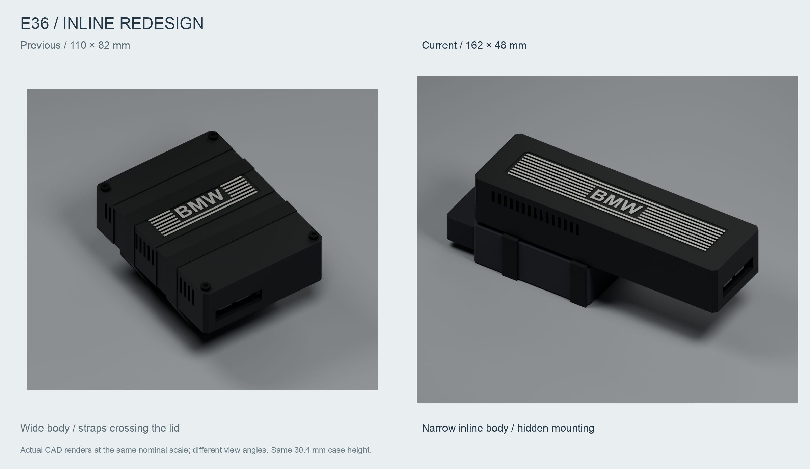
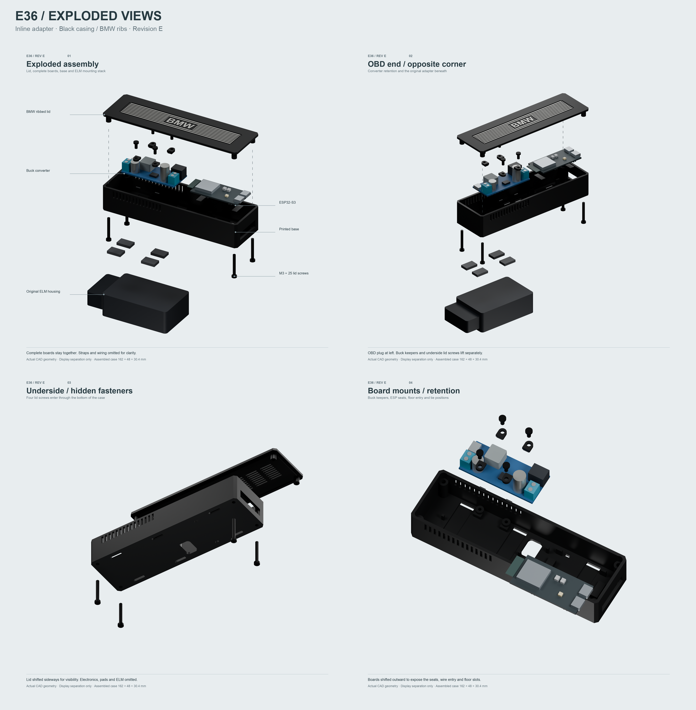

# Enclosure chat — visible conversation

Session: `01a07e53-ae96-7b91-8f25-bf9802ad1c1f`. Snapshot captured 2026-09-12T01:02:12.136045+00:00.

User task messages and user-visible assistant replies/progress are preserved below. Execution instructions, private reasoning, tool traffic, and binary image payloads are omitted. Local artifact links are made relative to the repository. Original attachments are in [the reference folder](../../hardware/elm-backpack/references/README.md).

For a concise continuation guide, see [the handoff](2026-09-11-elm-backpack.md).

## 2026-09-08T00:04:10.076Z — User

../../hardware/elm-backpack/references/C7Ws7u/image.png ../../hardware/elm-backpack/references/1oUab5/Screenshot 2026-09-07 at 21.01.18.png ../../hardware/elm-backpack/references/C2j69D/image.png ../../hardware/elm-backpack/references/JtD1lp/Screenshot 2026-09-07 at 21.01.42.png ../../hardware/elm-backpack/references/NnfwtA/Screenshot 2026-09-07 at 21.02.11.png ../../hardware/elm-backpack/references/IZgJo3/WhatsApp Image 2026-09-07 at 21.03.03 (2).jpeg ../../hardware/elm-backpack/references/bQd2Rp/WhatsApp Image 2026-09-07 at 21.03.03 (1).jpeg ../../hardware/elm-backpack/references/BzqjeP/WhatsApp Image 2026-09-07 at 21.03.03.jpeg

Make a proper case for the buck converter and the esp32 to go along the elm bt thingy, i made a whole for the wires down the bottom. Can be 3D printed. Plan it, find any measurement you need, then model it

## 2026-09-08T00:04:15.110Z — Assistant

I’ll inspect the photos and workspace, identify the boards and dimensions, then design a printable enclosure around the wiring exit and ELM Bluetooth adapter.

## 2026-09-08T00:04:56.365Z — Assistant

The photos show the ESP32’s headers and jumper plugs need substantial clearance, and neither board has usable mounting holes. I’m designing padded board supports, removable retention, a vented screw-on lid, and a protected cable route from the hole you made. The existing CAD in this repo is for a different circuit board, so this will be a separate model.

## 2026-09-08T00:07:08.568Z — Assistant

I found conflicting dimensions in the seller listings, including an implausible size for the buck board. I’m using a conservative 63.5 × 27.5 mm buck envelope and 65 × 28 mm ESP32 envelope, with adjustable mounts and a small fit-check print. The case will sit on the ELM’s back with two straps, so it won’t depend on an exact snap-fit to that housing.

## 2026-09-08T00:12:16.502Z — Assistant

The layout is now set: a 110 × 80 mm case, with the buck on padded edge clamps and the ESP32 raised above its jumper connectors. I’m building the editable CAD and print files next, including a wide USB access opening and cable strain relief. The measurement sources, assumptions, and assembly decisions are recorded in the plan.

## 2026-09-08T00:17:08.258Z — Assistant

The CAD checks caught two clashes: the left buck clamps needed more room beside the wall, and the cable anchor touched the solder clearance. I widened the case to 82 mm and moved the anchor. Those checks now pass; I’m validating the exported meshes and preparing assembled and exploded previews.

## 2026-09-08T01:06:48.356Z — Assistant

The printable parts now pass the solid and mesh checks, and the 3MF contains one base, one lid, and four clamps. I’m finishing the visual inspection and assembly guide. Since the exact boards and drilled hole haven’t been measured, I’m including a small gauge to check fit before the full print.

## 2026-09-08T01:06:54.387Z — User

Continue

## 2026-09-08T01:06:58.047Z — Assistant

I’m continuing with the final visual and slicer checks, then packaging the CAD, print files, and instructions together.

## 2026-09-08T01:10:10.741Z — User

We can do a lower profile if you need to, i can remove the headers and solder to the pins

## 2026-09-08T01:11:10.009Z — Assistant

That helps. I’ll switch the ESP32 mount to direct-soldered wires and lower the case. The buck’s capacitors will set the minimum height, so I’ll keep their clearance and make that dimension adjustable once you can measure the tallest one.

## 2026-09-08T01:12:58.604Z — User

Also id rather have the usb in the oposite direction

## 2026-09-08T01:14:01.835Z — Assistant

I’ll turn the ESP32 around so its USB ports face the wire-exit end, away from the OBD plug. I’ll also move the internal cable entry to keep it clear of the USB connectors and board supports.

## 2026-09-08T01:17:17.312Z — Assistant

The revised case is 30.4 mm tall—4.4 mm lower—with the USB ports at the wire-exit end. It uses direct-soldered ESP32 connections, and the base height now adjusts automatically from the capacitor-height parameter. I’m updating the previews and print package to match this version.

## 2026-09-08T01:22:35.078Z — Assistant

The model checks pass, including clearance around both USB plugs. I’m finishing the updated previews and checking that the print package opens correctly in the slicer. The fit gauge is included so you can check the estimated board dimensions before printing the full case.

## 2026-09-08T01:24:47.307Z — Assistant

The print file is recognized by Bambu Studio as geometry-only, so it won’t overwrite printer settings. The design includes a screw-on lid, removable buck clamps, an ESP retaining tie, and strain relief beside the bottom wire opening.

## 2026-09-08T01:27:41.241Z — Assistant

The updated viewer shows the lower case with USB facing away from the OBD plug. I’m bundling the CAD, print files, dimensioned drawing, and assembly instructions. Physical fit still needs checking, especially the capacitor height and your drilled hole’s position.

## 2026-09-08T01:29:01.459Z — Assistant

Modeled the **110 × 82 × 30.4 mm** case with USB facing the wire-exit end, **away from the OBD plug**. It uses direct-soldered ESP32 connections, a vented screw-on lid, removable buck clamps, and bottom cable entry with strain relief.

- [Complete package: STL, STEP, 3MF and editable source](../../hardware/elm-backpack/elm-backpack-rev-b.zip)
- [Interactive 3D viewer](../../hardware/elm-backpack/viewer.html)
- [Measurements and design plan](../../hardware/elm-backpack/PLAN.md)
- [Printing and assembly instructions](../../hardware/elm-backpack/README.md)

CAD and mesh checks passed; the 3MF imports into Bambu Studio. **Print the included fit gauge first:** board dimensions, capacitor height, and your drilled-hole position still need physical verification.

## 2026-09-08T01:29:55.811Z — User

I like that you tried to style it your own way, make it more 90s BMW engine bay styl,e you know what i mean?

## 2026-09-08T01:29:59.304Z — Assistant

I’ll restyle it around the E36 engine-bay look: dark plastic, recessed panels, parallel ribs, and restrained lettering. I’ll keep the lower profile and rear-facing USB layout.

## 2026-09-08T01:32:38.893Z — Assistant

The M50 covers are a good reference: black moulded plastic, closely spaced silver ribs, and a bold BMW wordmark. I’m working that pattern into the lid and giving the base squarer shoulders, with the straps in plain recessed lanes.

## 2026-09-08T01:37:23.270Z — Assistant

The first geometry check passes. The ribbed lid still fits within the 30.4 mm height: its background is recessed, leaving the ribs and lettering flush with the outer edge for printing. I’m checking the updated vents and rendering both the silver-highlighted finish and an all-black version.

## 2026-09-08T01:40:25.932Z — Assistant

The restyled CAD and print files pass the geometry checks. The lid now has the M50-style rib and lettering pattern, and the viewer lets you compare silver highlights with all-black plastic. The silver finish can be painted onto a single-material print; the board mounts and rear USB position are unchanged.

## 2026-09-08T01:41:20.410Z — Assistant

Restyled the actual model with **silver ribs, BMW lettering, squared shoulders, recessed side panels, and an engraved “E36 / DIAGNOSE” marking**.

Still **30.4 mm tall**, with USB facing away from the OBD plug. It prints in one material; the silver highlights are optional paint.

[Updated print files + editable CAD](../../hardware/elm-backpack/elm-backpack-rev-c.zip) · [Interactive viewer](../../hardware/elm-backpack/viewer.html) · [All-black preview](../../hardware/elm-backpack/exports/black.png)

Geometry and mesh checks passed. The physical fit check still applies.

## 2026-09-08T01:43:33.802Z — User

Remove the Diagnose, just E36

## 2026-09-08T01:43:37.088Z — Assistant

I’ll change the engraving to just “E36” and regenerate the affected model, previews, and print package.

## 2026-09-08T01:44:58.722Z — Assistant

The engraving now reads “E36,” and the CAD and mesh checks pass. The updated previews are rendering.

## 2026-09-08T01:46:26.203Z — Assistant

The new render is checked: just “E36,” centered in the original position. I’m packaging the refreshed files now.

## 2026-09-08T01:46:41.594Z — Assistant

Done—the engraving now says **E36** only.

[Updated print package](../../hardware/elm-backpack/elm-backpack-rev-c.zip) · [Preview](../../hardware/elm-backpack/exports/assembled.png)

## 2026-09-08T01:49:41.890Z — User

Looks to much like a retro Mac, why? This is just an engine bay ECU "adapter", black out, I like the BMW with the stripes that is dope.

## 2026-09-08T01:49:51.445Z — Assistant

The light render, broad flat panels, and small “E36” engraving are giving it that computer-box feel. I’ll make it read as a black engine-bay module: remove the E36 engraving, simplify the casing, and keep the BMW-and-stripes detail.

## 2026-09-08T01:52:40.842Z — Assistant

I’m also moving the broad lid grille to the sides and removing the decorative panel outlines. The BMW stripes will be the main detail on a plain black casing. I’ll correct the lighting too—the previous render made the black plastic look grey.

## 2026-09-08T01:55:48.928Z — Assistant

The new render shows a black casing with the BMW stripes as the contrasting detail. The revised geometry passes the clearance and mesh checks; I’m finishing the updated views and print package.

## 2026-09-08T01:57:31.733Z — Assistant

The grey lighting, broad grille, and outlined panels gave it that look. I’ve simplified it to **black casing, black hardware, and side vents**, keeping **BMW + stripes** as the main detail.

[Updated CAD and print files](../../hardware/elm-backpack/elm-backpack-rev-d.zip) · [3D viewer](../../hardware/elm-backpack/viewer.html)

CAD and mesh checks passed.

## 2026-09-08T01:58:14.933Z — User

What, still the same dude

## 2026-09-08T01:58:26.746Z — Assistant

You’re right—I changed the finish, but kept the same broad box, lid layout, and straps. I’ll redesign the actual shape as a narrow inline enclosure behind the ELM, with the buck and ESP arranged end-to-end and the BMW stripes running along the lid.

## 2026-09-08T02:04:41.591Z — Assistant

The new layout is 162 × 48 mm—41% narrower, with 52 mm more length. I’m moving the lid screws and mounting straps underneath so the top is one uninterrupted BMW ribbed cover. The rear USB direction stays the same.

## 2026-09-08T02:09:07.809Z — Assistant

The narrower body is modeled now. I’m checking the hidden lid screws and under-board strap paths before rendering it—the new version has a completely clear top and a long BMW stripe detail.

## 2026-09-08T02:11:22.232Z — Assistant

The end-to-end layout clears both boards and the rear USB plugs. I’m finishing the mounting details and generating a direct comparison with the previous version so the shape change is easy to see.

## 2026-09-08T02:13:30.232Z — Assistant

The CAD checks pass: the printed parts are valid solids, the board and strap clearances are clear, and the printable 3MF is rebuilt. I’m checking the new renders and viewer now; the main tradeoff is the longer tail, which has its own support-tie position.

## 2026-09-08T02:16:18.874Z — Assistant

The new render shows the intended change: a narrow black module, a long BMW ribbed cover, and mounting entirely underneath. The USB remains at the rear. I’m packaging the updated print files and the before/after comparison.

## 2026-09-08T02:19:32.353Z — Assistant

You were right—I’d kept the same basic box. I’ve now rebuilt it with **41% less width**, boards end-to-end, screws and straps underneath, and a long BMW ribbed lid. USB stays at the rear.

[Open 3D viewer](../../hardware/elm-backpack/viewer.html) · [Download STL, STEP and 3MF](../../hardware/elm-backpack/elm-backpack-rev-e.zip)

**162 × 48 × 30.4 mm.** CAD and mesh checks pass. Physical fit still needs checking, and the longer tail has a separate support-tie position.

## 2026-09-08T02:34:32.698Z — User

The long one is cool af

## 2026-09-08T02:34:42.703Z — Assistant

Long one it is. We’ll keep that shape, the black finish, BMW ribs, hidden mounting, and rear USB.

## 2026-09-08T02:46:08.229Z — User

Make me some exploded views

## 2026-09-08T02:46:15.496Z — Assistant

I’ll make a few exploded views of the long version, showing how the lid, boards, mounts, and ELM fit together.

## 2026-09-08T02:47:01.712Z — Assistant

I’m making four angles: two assembly views, an underside view for the hidden screws, and a closer view of the board mounts. The boards will lift out as complete assemblies so the assembly order stays clear.

## 2026-09-08T02:50:00.082Z — Assistant

The labelled assembly view is ready. I’m finishing the underside and board-mount views so you can see the screw access, supports, and wire entry.

## 2026-09-08T02:51:47.289Z — Assistant

All four views are rendered. I’m checking the final sheet and packing the full-resolution images, including transparent versions you can reuse.

## 2026-09-08T02:52:06.685Z — Assistant

Made four exploded views: **labelled assembly, opposite angle, underside screws, and board mounts**, all rendered from the actual CAD.

[Download full-resolution images and transparent versions](../../hardware/elm-backpack/elm-backpack-exploded-views.zip)

## 2026-09-12T00:57:04.518Z — User

have everything commited and pushed, this chats session context too

## 2026-09-12T00:57:17.909Z — Assistant

I’ll review the workspace changes, save a handoff note with this chat’s design decisions and remaining checks, then commit and push everything on the current branch.

## 2026-09-12T00:58:28.009Z — Assistant

I’m using Conductor’s workspace guidance for the handoff. The case is already committed; there are newer iOS, vehicle-model, and PCB changes in the workspace too. I’ll include those as requested and save a readable chat transcript alongside the design summary.

## 2026-09-12T01:00:41.577Z — Assistant

The firmware tests and Swift core tests pass. I found this chat’s original session log, so I can preserve its visible conversation, the approved case details, and the reference images. The large design files will use the repository’s existing Git LFS setup.
