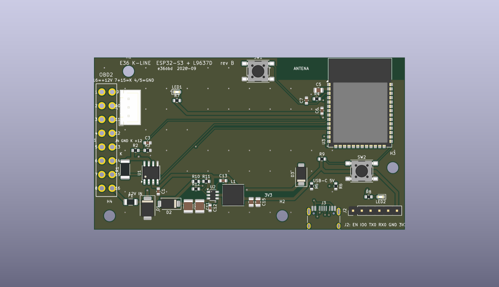
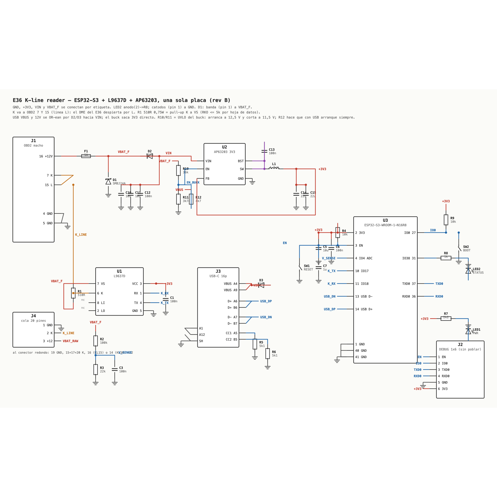
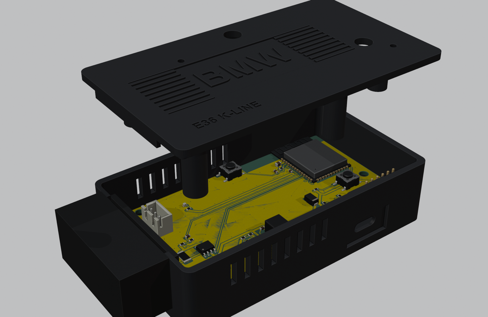

# E36 K-line — una sola placa (rev B)

ESP32-S3-WROOM-1 + L9637D + buck AP63203 + ficha OBD2 macho, todo en una PCB de **90 × 50 mm**,
dos capas, para mandar a JLCPCB con ensamblado SMD. Reemplaza al conjunto "ELM327 destripado +
DevKitC-1 + módulo buck" y a la placa `../kline-frontend.kicad_pcb` (que dejaba el MCU afuera).



| Archivo | Qué es |
|---|---|
| `gen_board.py` | **La fuente.** Colocación, redes, clases de pista, footprint OBD2, zonas, serigrafía. Genera la placa. |
| `e36-kline-onboard.kicad_pcb` / `.kicad_pro` | Placa generada y ruteada (abrir en KiCad 10). |
| `e36obd.pretty/OBD2_Male_RightAngle_16P.kicad_mod` + `fp-lib-table` | Footprint propio de la ficha OBD2. |
| `gen_schematic.py` → `schematic.svg`, `e36-kline-onboard.net` | Esquema y netlist, generados de **las mismas redes** que la placa y verificados contra ellas. |
| `export.py` → `fab/` | DRC, gerbers (`e36-kline-onboard-gerbers.zip`), `bom-jlcpcb.csv`, `cpl-jlcpcb.csv`, renders. |
| `case.py` → `case/` | Caja de dos piezas (STL listos para imprimir, STEP, ensamble con referencias). |
| `render_case.py` → `case/render-*.png` | Renders en Blender de la caja con la placa real (GLB exportado por kicad-cli) adentro. |

Estado: **DRC 0 errores, 0 desconexiones** (KiCad 10.0.5). Quedan ~50 avisos de serigrafía
(referencias de 0603 que pisan pads); JLC los recorta solos.



## Qué hay en la placa

```
 OBD2 16 ─ F1 1A ─┬─ D1 TVS SMBJ24A ─ GND
                  ├─ R1 510R ─ K ─── OBD2 7 y 15 ──┐
                  ├─ U1 L9637D VS        K ────────┘   RX → GPIO18   TX ← GPIO17
                  ├─ R2 100k / R3 22k ── V_SENSE → GPIO4 (ADC1)
                  ├─ R10 36k / R11 3k74 ─ EN del buck (UVLO: ON 12,5 V, OFF 11,5 V)
                  └─ D2 SS34 ─┬─ VIN ─ U2 AP63203 ─ L1 4.7µH ─ 3V3 ─ ESP32-S3-WROOM-1-N16R8
 USB-C VBUS ─ D3 SS34 ────────┘  └ R12 4k7 → EN (con USB arranca siempre)   │
 USB-C D+/D- ─────────────────────────────────────────── GPIO20/19 ┘
 J4 (cola al redondo de 20): 1 GND · 2 K · 3 +12   — en paralelo con la ficha OBD2
```

- **3,3 V directo desde los 12 V**, sin riel de 5 V. El único consumidor de 5 V era el DevKit.
  El AP63203 (3,8–32 V de entrada, 2 A, salida fija 3,3 V, 1,1 MHz) alimenta módulo y L9637D.
  FB va directo a 3V3 (versión de salida fija).
- **Corte por batería baja, en hardware.** El pin EN del buck tiene umbral de precisión (1,18 V
  sube / 1,10 V baja) y dos fuentes de corriente internas (1,5 µA fija + 4 µA de histéresis).
  Con R10 = 36k desde VBAT_F y R11 = 3,74k a GND (Eq. 1 y 2 de la hoja de datos) el buck
  **arranca a 12,5 V y corta a 11,5 V**: con el motor andando (13,1–14,4 V) está siempre
  encendido; con el motor parado sigue hasta que la batería baja a 11,5 V y ahí se apaga solo,
  quedando el consumo en ~1 mA (1 µA del buck apagado + los divisores + el reposo del L9637D).
  R12 = 4k7 desde VBUS fuerza EN por encima del umbral: **con USB arranca siempre**, haya auto
  o no. La ventana entre batería en reposo (12,6–12,8 V) y alternador flojo (13,1 V) es
  demasiado angosta para detectar "motor parado" solo con resistencias, así que el corte
  duro es el piso de seguridad: lo que evita el drenaje diario es el **deep sleep por
  V_SENSE** en el firmware (dormir por debajo de ~12,9 V unos minutos, despertar y medir).
  Para otros umbrales: `R10 = (0,932·VON − VOFF)/4,1 µA`, `R11 = 1,1·R10/(VOFF − 1,1 + 5,5 µA·R10)`.
- **USB-C solo para programar y para el banco**: VBUS y los 12 V del auto se OR-ean por D2/D3 hacia
  VIN. Con el auto y la notebook enchufados a la vez mandan los 12 V; nada vuelve a la notebook.
  Sin auto, la línea K y V_SENSE están muertas; el ESP32 arranca igual.
- **L9637D** igual que el prototipo que funcionó: VCC a 3,3 V (mínimo 3 V, lógica compatible
  sin conversor), VS a los 12 V filtrados, K a los pines **7 y 15** (el DME despierta por L).
  R1 510 Ω es el pull-up de K a VS que exige la hoja de datos. A 14 V disipa 0,38 W mientras K
  está baja, así que va en **2010** (0,75 W), no en 0805 como en la placa anterior.
- **D1 con la banda hacia +12 V.** En `../kline-frontend` el TVS estaba al revés en el netlist
  (ánodo a +12 V): conduciría a 0,7 V y volaría el fusible. Acá pad 1 (cátodo) = VBAT_F.
  Polaridad invertida del auto → el TVS conduce en directo y F1 corta. Ese es el mecanismo.
- **Sensado de batería**: 100k/22k → 16 V = 2,88 V en GPIO4. `V = 3,3 × adc/4095 × 122/22`.
  El firmware de hoy no lo lee (la tensión viene del DME por K); queda para dormir el módulo
  cuando el motor está parado — el pin 16 es +12 V **permanente**.
- **Módulo entero sobre la placa**, con la antena en el borde superior y una zona prohibida
  (sin cobre, pistas ni vías en las dos caras) de 53–90 × 0–6,5 mm: la opción 2 de la guía de
  Espressif. Se eligió para que la caja sea un prisma liso; la opción 1 (antena colgando) rinde
  algo mejor pero obliga a un saliente. La pared de la caja frente a la antena no puede ser
  metálica ni con carga de carbono.
- **Directo al conector redondo de 20 pines del E36, sin adaptador.** J4 es una JST-XH de 3 vías en
  paralelo con la ficha OBD2: 1 GND, 2 K, 3 +12 V. Se le suelda una cola cortada de un adaptador
  20→OBD2 (o un macho de 20 con cables): **19 → GND, 15+17+20 juntos → K, y el +12 de 16 (KL15,
  ignición) o de 14 (KL30, batería)**. Tomando el +12 del **pin 16** la placa se apaga con la
  llave y el drenaje de batería desaparece del todo; el OBD2 no tiene ese pin, por eso ahí hace
  falta el UVLO y el deep sleep. El macho de 20 no existe para montar en PCB: va por cable. Para
  ese uso, `CASE_PIGTAIL=1 case.py` genera la caja con la pared cerrada y un pasacable de 7 mm en
  vez de la muesca de la ficha.
- **USB: solo el nativo (GPIO19/20), sin puente CH340/CH9102.** Es el puerto "USB" del DevKit, no
  el "COM": MicroPython, `mpremote` y la REPL andan sin tocar nada; grabar la imagen de MicroPython
  exige BOOT apretado al resetear (una vez). Se evaluó poner un CH340C con auto-reset y se descartó
  por innecesario.
- EN: 10k + 1 µF + botón RESET. IO0: 10k + botón BOOT. Programación por el USB nativo
  (GPIO19/20) o por J2 (UART0, sin poblar; pines **EN IO0 TX0 RX0 GND 3V3**). LED verde = 3V3;
  LED ámbar en **GPIO38** (el mismo del RGB del DevKitC-1 v1.1, así el firmware no cambia de pin).

### Pines del ESP32 que usa el firmware

| GPIO | Función | Pin del módulo |
|---|---|---|
| 17 | K_TX → L9637D TX (UART1 + bit-bang del init a 5 baudios) | 10 |
| 18 | K_RX ← L9637D RX | 11 |
| 4 | V_SENSE (ADC1_CH3, funciona con WiFi) | 4 |
| 38 | LED de estado (ámbar) | 31 |
| 0 | BOOT (botón, pull-up 10k) | 27 |
| 19 / 20 | USB D− / D+ | 13 / 14 |
| 43 / 44 | TXD0 / RXD0 → J2 | 37 / 36 |

`firmware/mp/kline.py` sigue con `TX_PIN = 17`, `RX_PIN = 18`: no cambia nada.
En la N16R8 los GPIO 33–37 son de la PSRAM y no se usan.

## La ficha OBD2

Es un macho J1962 acodado de montaje en PCB — el mismo formato que usan los ELM327 y el
**Macchina CCBDM20**. El footprint se construyó desde el STEP y el plano de ese conector,
no de una foto:

| Dato | Valor |
|---|---|
| Paso entre pines de una fila | **4,00 mm** |
| Separación entre filas | **3,00 mm** |
| Fila 1–8 (la de abajo en la cara de enchufe, lado ancho de la D) | 2,25 mm detrás de la brida |
| Fila 9–16 | 5,25 mm detrás de la brida |
| Pata de soldadura | 0,9 × 0,8 mm, ~2,2 mm de largo → agujero 1,3 mm, pad 2,1 mm |
| Cuerpo | 40,3 mm de ancho, todo fuera de la placa; la brida apoya en el borde |

El borde izquierdo de la placa es el plano trasero de la brida. Pin 1 arriba (y = 10 mm),
pin 8 abajo; pines 9–16 en la segunda fila. Solo 4, 5 (GND), 7 (K), 15 (L) y 16 (+12 V) van
a algo; los otros once pads quedan sueltos.

**Antes de soldar el conector**, con la placa sin enchufar al auto, medir continuidad entre
la cara de enchufe y los pads: el pin 16 del macho (esquina, fila de abajo con el lado ancho
arriba, extremo izquierdo mirando los pines) tiene que llegar al pad marcado 16. Si el
conector que compraste está espejado respecto del CCBDM20, el error es **benigno**: +12 V
caería en el pad 9 (sin conectar) y la placa simplemente no encendería. Nada se quema.

## Antes de mandar a fabricar

1. **Números LCSC.** Los marcados `verificar` o `C?` en `fab/bom-jlcpcb.csv` hay que
   confirmarlos en la librería de JLC al momento de pedir: L9637D (C130489), módulo
   ESP32-S3-WROOM-1-**N16R8** (C2913202), inductor SWPA6045S4R7MT (C78804), TVS SMBJ24A,
   capacitores 1210 10 µF/50 V X7R, la 2010 de 510 Ω y la 0603 de 3,74k (E96). El resto son
   básicos de JLC.
2. **Variante del módulo.** El firmware cargado es `ESP32_GENERIC_S3-SPIRAM_OCT`: necesita
   PSRAM octal → **N16R8** (o N8R8). Una N16 sin R8 arranca pero ese build no.
3. **Ficha OBD2.** J1 es THT: soldarla a mano (patas cortas, estañar desde abajo) o pedir el
   ensamblado TH de JLC (`C9900166046`, "OBD-II-16P-Male-90-Deg", sin plano público:
   verificar su footprint contra la tabla de arriba antes de confiar).
4. **Capacidades JLC**: 2 capas, 1,6 mm, 1 oz. Pista mínima usada 0,187 mm (los cuellos que
   deja Freerouting en los pines finos), holgura mínima 0,15 mm, vía 0,7/0,35, taladro mínimo
   0,3. Todo dentro de lo estándar (0,127 mm / 0,3 mm).
5. **En la vista previa de JLC** revisar la rotación de lo polarizado: D1, D2, D3 (banda),
   LED1/LED2, U1 (pin 1), U2, U3. El CPL sale con el origen en la esquina inferior izquierda.
6. J2 no se puebla (está fuera del BOM y del CPL).
7. La caja es `case.py` (sección **La caja**); la `../elm-backpack` no sirve para esta placa.
8. Si vas directo al conector de 20 pines, no hace falta soldar la ficha OBD2 (J1): con J4 y la
   cola alcanza, y la caja `-pigtail` cierra esa pared.

## La caja

`case.py` (build123d, `~/Desktop/E36_OBD/.cadenv/bin/python hardware/onboard/case.py`) genera
en `case/` una caja de dos piezas para **esta** placa, con las mismas coordenadas de
`gen_board.py`. La `../elm-backpack` no sirve: era para las placas sueltas.




| | |
|---|---|
| Exterior | **96,8 × 56,0 × 26,4 mm**, prisma liso, más los 16 mm del conector |
| Paredes / piso / tapa | 2,4 mm; la pared del conector 1,5 mm |
| Interior sobre la placa | 17 mm — lo fija la brida del conector (15,6 mm), no la electrónica (máx. 5 mm) |
| Sujeción | 4 × **M3 × 16** desde abajo, cabeza embutida; pasan por los separadores (3 mm) y la placa y roscan en los postes de la tapa (piloto 2,6 mm) |
| Variante | `CASE_PIGTAIL=1`: sin muesca para la ficha OBD2, pared izquierda cerrada con pasacable Ø7 para la cola al conector de 20 (`base-pigtail.stl`, `lid-pigtail.stl`) |
| Conector OBD2 | la pared entra en el **cuello de 2 mm** del conector: la brida queda adentro, el cuerpo afuera. La muesca está abierta hacia arriba para bajar la placa; la lengüeta de la tapa la cierra |
| USB-C | **la ficha atraviesa la pared**: sobresale 1,6 mm del borde de la placa y pasa por una abertura con la forma de su blindaje (estadio 9,4 × 3,6, 0,22 de juego por lado) en una pared local de 1,3 mm; la boca queda a ras del fondo de un bisel de 18 × 10 donde entra el sobremoldeado del cable. Una repisa de 1,2 mm bajo el borde de la placa toma el empuje del enchufe |
| Antena | queda dentro, contra la pared trasera: esa pared no puede ser metálica ni con carga de carbono |
| Botones / LEDs | agujeros Ø6 sobre RESET y BOOT (quedan 12 mm abajo: se pulsan con un lápiz) y Ø2,2 sobre los dos LEDs |
| Tapa | campo rebajado 0,5 mm de 68 × 22 mm con **nueve nervios y el "BMW"** a ras, como la tapa de válvulas M50 (=BMW=); "E36 K-LINE" grabado chico al frente. Opcional: pintar de plata solo el lomo de los nervios y las letras |
| Otros | 8 respiraderos por lado (2 × 8 mm), dos ranuras 3 × 12 en el piso para un precinto |

Archivos: `base.stl` (piso abajo), `lid.stl` (**ya dada vuelta**, cara exterior abajo), `base.step`,
`lid.step` (en coordenadas de montaje) y `assembly.step` con la placa, el módulo, el conector y
los volúmenes de los componentes más altos como referencia. Renders: `render_case.py` (Blender 4.5,
Workbench) mete el GLB de la placa (`kicad-cli pcb export glb --drill-origin`) en la caja y saca
`render-assembled/open/board/rear/connector-end.png`. El conector se dibuja como bloque: no hay
modelo 3D libre del CCBDM20 en KiCad.

Verificado por el script: cada pieza es un sólido válido y ninguna interfiere con la placa, el
módulo, la brida/cuello/cuerpo del conector, el USB-C, los botones, el inductor, el TVS ni los
pads de la ficha (la muesca del conector pasa la prueba con 0,15 mm hacia el cuerpo y 0,35 hacia la
brida). El campo rebajado se imprime cara abajo: los puentes entre nervios son de 1,25 mm. **No verificado**: el juego real del cuello contra un conector medido, la tolerancia de tu
impresora en los pilotos de 2,6 mm y en el labio de 0,3 mm, y la temperatura en vano motor (ASA).

Imprimir: 0,4 mm, 0,2 mm de capa, 4 paredes; base piso abajo, tapa cara exterior abajo (los
grabados quedan contra la cama, como en la elm-backpack). Sin soportes salvo, si hace falta, el
techo de la ventana USB.

## Lo que no se verificó

- **Encaje físico del conector.** Sale de un STEP, no de un conector medido. Antes de soldar,
  apoyar el conector sobre la placa y ver que las 16 patas entren.
- **Ruteo automático.** Freerouting (2.4.1, 30 pasadas) hizo las pistas; yo fijé colocación,
  anchos por clase (potencia 0,8 mm, K 0,5, USB 0,2, señal 0,25) y 80 vías de costura de GND.
  El lazo del buck es corto (SW → L1 a 2,4 mm) pero no está optimizado a mano.
- **Térmica en vano motor.** AP63203 hasta 125 °C de juntura; módulo −40…85 °C ambiente.
  Nadie midió la temperatura donde va a vivir.
- **Consumo con motor parado.** ~40–100 mA continuos del módulo despierto = 1–2,4 Ah/día de la
  batería. Es firmware (deep sleep por V_SENSE), no placa.

## Regenerar

```sh
PY=/Applications/KiCad/KiCad.app/Contents/Frameworks/Python.framework/Versions/3.9/bin/python3
$PY hardware/onboard/gen_board.py                # colocación + redes + zonas, sin pistas
FREEROUTING=/tmp/fr/freerouting.jar PASSES=30 \
$PY hardware/onboard/gen_board.py --route        # exporta DSN, rutea, importa SES, cose GND
$PY hardware/onboard/export.py                   # DRC, gerbers, BOM, CPL, renders en fab/
python3 hardware/onboard/gen_schematic.py        # schematic.svg + .net verificados contra N
```

Freerouting: `curl -L -o /tmp/fr/freerouting.jar https://github.com/freerouting/freerouting/releases/download/v2.4.1/freerouting-2.4.1.jar`
(necesita Java 21+; con `-mt 1` para que el optimizador no genere violaciones de holgura).
